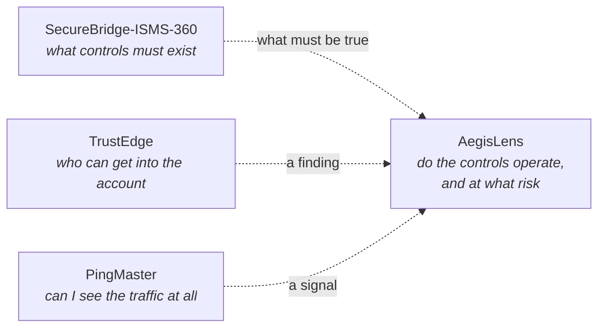

<!--
  het-P301204 — profile README
  An index to the repositories, not a homepage. The chart plots what has
  actually been built; repositories are the only bright marks on it.

  The chart is generated: sync.mjs pulls repos, dates and language mix from
  the GitHub API, build.mjs renders the SVGs, and .github/workflows/refresh.yml
  runs both daily. Classify a new repo once in record.json "map" and the
  chart maintains itself. This index is hand-written on purpose — it holds
  judgement (what to read first, why it exists) that cannot be generated.

  INTERACTION NOTE: chip hrefs must target #user-content-* because GitHub
  prefixes id attributes but leaves hrefs alone. Fragment navigation into a
  closed 
 opens it — and opens every ancestor, so a repo link opens
  its domain too. Do not remove the bare <a id="..."> tags; they are the targets.
-->

<picture>
  <source media="(max-width: 620px)" srcset="assets/record-mobile.svg">
  
</picture>

<a href="#user-content-d-assurance"><kbd> ASSURANCE </kbd></a>
<a href="#user-content-d-engineering"><kbd> ENGINEERING </kbd></a>
<a href="#user-content-d-detection"><kbd> DETECTION </kbd></a>
<a href="#user-content-d-appsec"><kbd> APPSEC </kbd></a>
<a href="#user-content-d-cloud"><kbd> CLOUD </kbd></a>
<a href="#user-content-d-offensive"><kbd> OFFENSIVE </kbd></a>

 

<a href="#user-content-r-trustedge"><kbd> ↳ &nbsp;NEW HERE? START WITH TRUSTEDGE &nbsp;</kbd></a>
<a href="https://github.com/het-P301204/het-P301204/issues/new?template=teardown.md&title=teardown%7C%3CYOUR%20TOPIC%3E"><kbd> ⊕ &nbsp;REQUEST A TEARDOWN &nbsp;</kbd></a>

I work on the load-bearing parts of security — how a control is evidenced, how
risk becomes a number someone can act on, and how a system tells you it is
being abused. I am mostly interested in why things fail and what makes them
hold.

<!--TESTS:START-->
**709 tests** across the lab — AegisLens 108, TrustEdge 601. Counted from each repository's own README, not asserted here.
<!--TESTS:END-->

## Index

Four repositories across five of six domains. Open a domain, then open a
repository — the second level is where the evidence is. Repository names link
straight to the code.

<b>ASSURANCE</b> &nbsp;iso 27001 / isms / controls / evidence &nbsp;—&nbsp; 2 repositories

&nbsp;<b><a href="https://github.com/het-P301204/SecureBridge-ISMS-360">SecureBridge-ISMS-360</a></b> &nbsp;a whole ISMS, end to end

Ten interconnected GRC projects wired into a single management system —
governance, risk, controls, policy, audit, evidence, management review and
certification readiness for one fictional company.

| | |
| :-- | :-- |
| **Shape** | Documentation-led. The artefacts *are* the deliverable. |
| **Read first** | The risk register and the control-to-evidence mapping. |
| **Why it exists** | Most GRC examples show one control. This shows the system they live in. |

&nbsp;<b><a href="https://github.com/het-P301204/AegisLens-security-workbench">AegisLens</a></b> &nbsp;the tooling half of the same problem

Evidence in, risk scored, findings tracked, report out.

| | |
| :-- | :-- |
| **Stack** | `Python` `FastAPI` `React` `TypeScript` `Docker` |
| **Evidence** | 108 tests, CI, a worked example in `docs/` |
| **Read first** | `backend/tests` — if you want to know whether I can actually build. |
| **Also in** | [ENGINEERING](#user-content-r-aegislens-eng) — it genuinely spans both |

What I am chasing here: the smallest honest evidence set that proves a control operates.

<b>ENGINEERING</b> &nbsp;tooling / automation / risk scoring &nbsp;—&nbsp; 1 repository

&nbsp;<b><a href="https://github.com/het-P301204/AegisLens-security-workbench">AegisLens</a></b> &nbsp;read as software, not as GRC

A FastAPI service, a React client, a scoring model, a test suite and a
container. The GRC framing is the domain; this is the build.

| | |
| :-- | :-- |
| **Read first** | `backend/` for the API, then `backend/tests` |
| **Runs with** | `docker compose up` |
| **Also in** | [ASSURANCE](#user-content-r-aegislens) — the same repo, other lens |

AegisLens sits in two rows on the chart because it really does span both. That crossover is the work I find most interesting.

<b>DETECTION</b> &nbsp;telemetry / signals / triage &nbsp;—&nbsp; 1 repository

&nbsp;<b><a href="https://github.com/het-P301204/PingMaster">PingMaster</a></b> &nbsp;ping, with a graph

Cross-platform network latency you can actually read.

| | |
| :-- | :-- |
| **Stack** | `Rust` |
| **Why it is here** | The first half of every detection story is seeing the traffic at all. |

<b>APPSEC</b> &nbsp;secure sdlc / code review / api surface &nbsp;—&nbsp; empty

The one empty row, and I would rather show it than pin a tutorial.

Currently working through authorisation bugs that survive code review,
dependency trust, and what a useful API threat model looks like when the API
is small. When something ships, the chart fills itself in.

<b>CLOUD</b> &nbsp;identity / posture / logging / iac &nbsp;—&nbsp; 1 repository

&nbsp;<b><a href="https://github.com/het-P301204/TrustEdge-AWS-IAM-analyzer">TrustEdge</a></b> &nbsp;who outside your AWS account can get inside it

An IAM trust policy is a door — whoever gets through it is holding real AWS
credentials. TrustEdge reads those doors offline and grades each one by
exposure × blast radius.

| | |
| :-- | :-- |
| **Stack** | `Python 3.9–3.14` |
| **Evidence** | 601 tests, CI, **zero runtime dependencies** |
| **Runs** | Offline. No credentials, no API calls, nothing leaves the machine. |
| **Read first** | The trust-policy grading logic — that is where the argument is. |
| **Also in** | [OFFENSIVE](#user-content-r-trustedge-off) — it reasons about attack paths |

This is the row I most wanted to fill: the gap between what a cloud provider promises, what a control framework asks for, and what the policy actually permits.

<b>OFFENSIVE</b> &nbsp;attack paths / control validation &nbsp;—&nbsp; 1 repository

&nbsp;<b><a href="https://github.com/het-P301204/TrustEdge-AWS-IAM-analyzer">TrustEdge</a></b> &nbsp;ranked by exposure × blast radius

Read offensively, TrustEdge enumerates the inbound trust paths into an AWS
account and ranks them by how far an attacker gets once through one.

| | |
| :-- | :-- |
| **Answers** | Which principals outside the account can assume a role inside it? |
| **Then** | What can they reach once they have? |
| **Also in** | [CLOUD](#user-content-r-trustedge) — the same repo, defensive lens |

Offence here exists to validate the assurance and detection work above, not as a separate hobby. TrustEdge qualifies because it produces a defensible finding rather than a demo.

<b>HOW THE FOUR FIT TOGETHER</b> &nbsp;one diagram, click to expand it

**The arrows are dashed for a reason.** These are four separate tools, not an
integrated platform. The diagram shows how the *questions* relate — governance
says what must be true, TrustEdge and PingMaster produce evidence about the
world, and AegisLens is where evidence becomes a number someone can act on.

Wiring them together for real is the interesting problem, and it is not done.

<b>ON THE BENCH</b> &nbsp;what the lab is doing right now — updated by a robot, not by me

**Latest commits across every repository**

<!--ACTIVITY:START-->
- `dac014f` **[TrustEdge](https://github.com/het-P301204/TrustEdge-AWS-IAM-analyzer)** — Add the technical substance the README was missing 15h ago
- `d2f5a08` **[TrustEdge](https://github.com/het-P301204/TrustEdge-AWS-IAM-analyzer)** — Rewrite the README around diagrams, and diagram the architecture doc 15h ago
- `aa385ea` **[TrustEdge](https://github.com/het-P301204/TrustEdge-AWS-IAM-analyzer)** — Fix Python 3.9 test collection and the Docker bind-mount write 15h ago
- `09f2a77` **[TrustEdge](https://github.com/het-P301204/TrustEdge-AWS-IAM-analyzer)** — TrustEdge: AWS inbound trust boundary analyzer 15h ago
- `87d25bb` **[AegisLens](https://github.com/het-P301204/AegisLens-security-workbench)** — Add social preview card and README badges
 yesterday
<!--ACTIVITY:END-->

**The queue.** Anyone can add to it — the
[`REQUEST A TEARDOWN`](https://github.com/het-P301204/het-P301204/issues/new?template=teardown.md&title=teardown%7C%3CYOUR%20TOPIC%3E)
link opens a prefilled issue, an Action sanitises the title, appends it here
and closes the issue. I work through it in roughly the order it arrives.

<!--QUEUE:START-->
| In the queue | Requested by | Issue |
| :-- | :-- | :-- |
| S3 bucket policy evaluation order | [@het-P301204](https://github.com/het-P301204) | [#1](../../issues/1) |
<!--QUEUE:END-->

Think a repository is filed under the wrong domain?
<a href="https://github.com/het-P301204/het-P301204/issues/new?template=classify.md&title=classify%7C%3CREPO%3E%7C%3CDOMAIN%3E">Say so</a> —
I would rather be corrected than flattering about my own work.

This is the workshop. The <b><a href="https://hetpatel-lemon.vercel.app">portfolio</a></b> is where the story is.

  

<a href="https://hetpatel-lemon.vercel.app"><kbd> hetpatel-lemon.vercel.app </kbd></a>
<a href="https://www.linkedin.com/in/het-patel-913017345/"><kbd> LINKEDIN </kbd></a>
<a href="mailto:phb_hetpatel@outlook.com"><kbd> EMAIL </kbd></a>

 

The chart above rebuilds itself from the GitHub API every day. Every project uses synthetic data.

