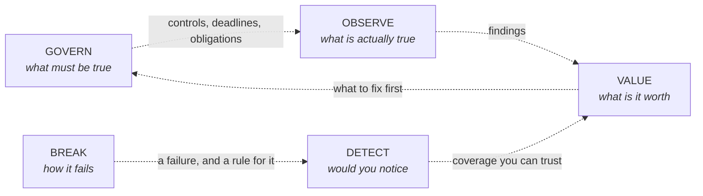

<!--
  het-P301204 — profile README

  MOSTLY GENERATED. sync.mjs pulls repositories, topics, dates, language mix,
  test counts and commits from the GitHub API; build.mjs renders the SVGs;
  .github/workflows/refresh.yml runs both twice daily and commits on change.
  Regions between <!==REGION:START==> markers are overwritten — do not hand-edit
  SUMMARY, INDEX, ACTIVITY or TESTS.

  ADDING A REPOSITORY needs no edit here at all. Tag it on GitHub and
  record.json topicMap classifies it. Optionally add a record.json "notes"
  entry for the prose a generator cannot write: what to read first, why it
  exists. Anything unclassifiable opens a self-closing issue.

  HAND-WRITTEN: this header, the intro paragraph, the mermaid diagram, the
  bench section and the footer.

  INTERACTION NOTE: chip hrefs must target #user-content-* because GitHub
  prefixes id attributes but leaves hrefs alone. Fragment navigation into a
  closed 
 opens it — and every ancestor — so a repo link opens its
  domain too. Do not remove the bare <a id="..."> tags; they are the targets.
-->

<picture>
  <source media="(max-width: 620px)" srcset="assets/record-mobile.svg">
  
</picture>

<a href="#user-content-d-assurance"><kbd> ASSURANCE </kbd></a>
<a href="#user-content-d-engineering"><kbd> ENGINEERING </kbd></a>
<a href="#user-content-d-detection"><kbd> DETECTION </kbd></a>
<a href="#user-content-d-appsec"><kbd> APPSEC </kbd></a>
<a href="#user-content-d-cloud"><kbd> CLOUD </kbd></a>
<a href="#user-content-d-offensive"><kbd> OFFENSIVE </kbd></a>
<a href="#user-content-d-aisec"><kbd> AI SECURITY </kbd></a>

 

<a href="#user-content-r-trustedge"><kbd> ↳ &nbsp;NEW HERE? START WITH TRUSTEDGE &nbsp;</kbd></a>
<a href="https://github.com/het-P301204/het-P301204/issues/new?template=teardown.md&title=teardown%7C%3CYOUR%20TOPIC%3E"><kbd> ⊕ &nbsp;REQUEST A TEARDOWN &nbsp;</kbd></a>

I work on the load-bearing parts of security — how a control is evidenced, how
risk becomes a number someone can act on, and how a system tells you it is
being abused. I am mostly interested in why things fail and what makes them
hold.

<!--TESTS:START-->
**2,906 tests** across the lab — AegisLens 108, TrustEdge 601, Pedigree 198, NullFire 424, BlackOut 230, AfterLife 290, sunset 44, credscope 93, sleeper 230, tombstone 497, parallax 191. Counted from each repository's own README, not asserted here.
<!--TESTS:END-->

## Index

<!--SUMMARY:START-->
16 repositories across 7 of 7 domains. Open a domain, then open a repository — the second level is where the evidence is. Repository names link straight to the code.
<!--SUMMARY:END-->

<!--INDEX:START-->

<b>ASSURANCE</b> &nbsp;iso 27001 / isms / controls / evidence &nbsp;—&nbsp; 5 repositories

&nbsp;<b><a href="https://github.com/het-P301204/SecureBridge-ISMS-360">SecureBridge</a></b> &nbsp;a whole ISMS, end to end

An interactive, evidence-driven ISO 27001 Integrated ISMS portfolio for SecureBridge Technologies Pvt. Ltd., connecting governance, risk, controls, policies, audits, evidence, management review, and certification readiness across 10 interconnected GRC projects.

| | |
| :-- | :-- |
| **Read first** | The risk register and the control-to-evidence mapping. |

&nbsp;<b><a href="https://github.com/het-P301204/AegisLens-security-workbench">AegisLens</a></b> &nbsp;evidence in, risk scored, report out

AegisLens is an educational and defensive security assessment workbench using synthetic data. It is not a replacement for a SIEM, GRC platform, vulnerability scanner, or professional security audit.

| | |
| :-- | :-- |
| **Stack** | `TypeScript` `Python` `CSS` |
| **Evidence** | 108 tests, CI |
| **Read first** | `backend/tests` — if you want to know whether I can actually build. |
| **Also in** | [ENGINEERING](#user-content-r-aegislens-engineering) |

&nbsp;<b><a href="https://github.com/het-P301204/sunset">sunset</a></b> &nbsp;what breaks when the cryptography expires

Cryptographic posture and post-quantum migration triage. Turns a CycloneDX CBOM into a deadline-anchored, risk-ranked migration plan — and says plainly what it could not assess. Offline, deterministic, no network.

| | |
| :-- | :-- |
| **Stack** | `TypeScript` `CSS` `Python` |
| **Evidence** | 44 tests, CI |
| **Runs** | Offline and deterministic. No network. |
| **Read first** | The triage output - especially the section listing what it could not assess. |

&nbsp;<b><a href="https://github.com/het-P301204/tombstone">tombstone</a></b> &nbsp;when retention and erasure collide

Retention x erasure reconciliation for security telemetry. Finds where security retention floors and privacy erasure obligations collide field by field, decides whether deletion is technically achievable, and emits machine-readable deletion metadata. Offline, deterministic, no dependencies beyond React.

| | |
| :-- | :-- |
| **Stack** | `TypeScript` `HTML` `JavaScript` |
| **Evidence** | 497 tests, CI |
| **Read first** | A field where the retention floor and the erasure obligation cannot both be met. |
| **Also in** | [DETECTION](#user-content-r-tombstone-detection) |

&nbsp;<b><a href="https://github.com/het-P301204/parallax">parallax</a></b> &nbsp;numbers that cannot carry the decision

Risk register measurement auditor. Finds where a qualitative risk register's numbers cannot support the decisions built on them, and triages the few risks worth quantifying.

| | |
| :-- | :-- |
| **Stack** | `TypeScript` `JavaScript` `CSS` |
| **Evidence** | 191 tests |
| **Read first** | The triage — which few risks are actually worth quantifying. |

What I am chasing here: the smallest honest evidence set that proves a control operates.

<b>ENGINEERING</b> &nbsp;tooling / automation / pipelines &nbsp;—&nbsp; 3 repositories

&nbsp;<b><a href="https://github.com/het-P301204/AegisLens-security-workbench">AegisLens</a></b> &nbsp;evidence in, risk scored, report out

AegisLens is an educational and defensive security assessment workbench using synthetic data. It is not a replacement for a SIEM, GRC platform, vulnerability scanner, or professional security audit.

| | |
| :-- | :-- |
| **Stack** | `TypeScript` `Python` `CSS` |
| **Evidence** | 108 tests, CI |
| **Read first** | `backend/tests` — if you want to know whether I can actually build. |
| **Also in** | [ASSURANCE](#user-content-r-aegislens) |

&nbsp;<b><a href="https://github.com/het-P301204/TrustEdge-AWS-IAM-analyzer">TrustEdge</a></b> &nbsp;who outside your AWS account can get inside it

Grades who outside an AWS account can become an identity inside it, ranked by exposure x blast radius. Offline IAM trust-policy analyzer - no credentials, no API calls, zero dependencies.

| | |
| :-- | :-- |
| **Stack** | `Python` `Dockerfile` |
| **Evidence** | 601 tests, CI |
| **Runs** | Offline. No credentials, no API calls, nothing leaves the machine. |
| **Read first** | The trust-policy grading logic — that is where the argument is. |
| **Also in** | [CLOUD](#user-content-r-trustedge-cloud) |

&nbsp;<b><a href="https://github.com/het-P301204/Pedigree-npm-provenance-gate">Pedigree</a></b> &nbsp;where did this dependency actually come from

Consumer-side npm provenance verification and policy enforcement. Verifies each dependency's origin against an expected source, then tells you what would break if you enforced it today. Verifies origin - not the absence of malicious code.

| | |
| :-- | :-- |
| **Stack** | `TypeScript` `JavaScript` |
| **Evidence** | 198 tests, CI |
| **Read first** | The dry-run report — what would break if you enforced the policy today. |
| **Also in** | [APPSEC](#user-content-r-pedigree-appsec) |

Security work only counts once it runs unattended. This row is the difference between an opinion and a tool.

<b>DETECTION</b> &nbsp;telemetry / signals / triage &nbsp;—&nbsp; 5 repositories

&nbsp;<b><a href="https://github.com/het-P301204/PingMaster">PingMaster</a></b> &nbsp;ping, with a graph

Ping, but with a graph. A simple, cross-platform tool for visualizing network latency. 🚀  A lightweight, intuitive, and cross-platform graphical ping for developers and network administrators.

| | |
| :-- | :-- |
| **Stack** | `Rust` `Roff` `Dockerfile` |

&nbsp;<b><a href="https://github.com/het-P301204/NullFire">NullFire</a></b> &nbsp;the Sigma rules that can never fire

Detection Matchability Analyzer - finds the Sigma rules that can never match your real post-pipeline data, explains why, and generates the minimal event that would prove each one can fire.

| | |
| :-- | :-- |
| **Stack** | `Python` |
| **Evidence** | 424 tests, CI |
| **Read first** | The matchability analysis — why a rule is dead against your real data. |

&nbsp;<b><a href="https://github.com/het-P301204/BlackOut">BlackOut</a></b> &nbsp;one control failure, followed all the way through

Security control failure & detection lab: an authorization fail-open, its exploit, root cause, fix, detection rule and regression test. Local red/blue lab, synthetic data only.

| | |
| :-- | :-- |
| **Stack** | `Python` `CSS` `JavaScript` |
| **Evidence** | 230 tests, CI |
| **Read first** | The exploit, then the detection rule written against it. |
| **Also in** | [APPSEC](#user-content-r-blackout-appsec) · [OFFENSIVE](#user-content-r-blackout-offensive) |

&nbsp;<b><a href="https://github.com/het-P301204/AfterLife">AfterLife</a></b> &nbsp;the password reset worked; the attacker stayed

Revocation persistence detection lab: when the password reset succeeds but the attacker never leaves. Reproduces the Strapi CVE-2026-22706 conditional-revocation bug, its fix, a three-rule detection pack, and the naive rule that misses it.

| | |
| :-- | :-- |
| **Stack** | `Python` `JavaScript` `CSS` |
| **Evidence** | 290 tests, CI |
| **Read first** | The naive detection rule that misses it - that contrast is the point. |
| **Also in** | [APPSEC](#user-content-r-afterlife-appsec) · [OFFENSIVE](#user-content-r-afterlife-offensive) |

&nbsp;<b><a href="https://github.com/het-P301204/tombstone">tombstone</a></b> &nbsp;when retention and erasure collide

Retention x erasure reconciliation for security telemetry. Finds where security retention floors and privacy erasure obligations collide field by field, decides whether deletion is technically achievable, and emits machine-readable deletion metadata. Offline, deterministic, no dependencies beyond React.

| | |
| :-- | :-- |
| **Stack** | `TypeScript` `HTML` `JavaScript` |
| **Evidence** | 497 tests, CI |
| **Read first** | A field where the retention floor and the erasure obligation cannot both be met. |
| **Also in** | [ASSURANCE](#user-content-r-tombstone) |

A control you cannot observe failing is a control you are trusting on faith.

<b>APPSEC</b> &nbsp;secure sdlc / code review / supply chain &nbsp;—&nbsp; 6 repositories

&nbsp;<b><a href="https://github.com/het-P301204/Pedigree-npm-provenance-gate">Pedigree</a></b> &nbsp;where did this dependency actually come from

Consumer-side npm provenance verification and policy enforcement. Verifies each dependency's origin against an expected source, then tells you what would break if you enforced it today. Verifies origin - not the absence of malicious code.

| | |
| :-- | :-- |
| **Stack** | `TypeScript` `JavaScript` |
| **Evidence** | 198 tests, CI |
| **Read first** | The dry-run report — what would break if you enforced the policy today. |
| **Also in** | [ENGINEERING](#user-content-r-pedigree) |

&nbsp;<b><a href="https://github.com/het-P301204/BlackOut">BlackOut</a></b> &nbsp;one control failure, followed all the way through

Security control failure & detection lab: an authorization fail-open, its exploit, root cause, fix, detection rule and regression test. Local red/blue lab, synthetic data only.

| | |
| :-- | :-- |
| **Stack** | `Python` `CSS` `JavaScript` |
| **Evidence** | 230 tests, CI |
| **Read first** | The exploit, then the detection rule written against it. |
| **Also in** | [DETECTION](#user-content-r-blackout) · [OFFENSIVE](#user-content-r-blackout-offensive) |

&nbsp;<b><a href="https://github.com/het-P301204/AfterLife">AfterLife</a></b> &nbsp;the password reset worked; the attacker stayed

Revocation persistence detection lab: when the password reset succeeds but the attacker never leaves. Reproduces the Strapi CVE-2026-22706 conditional-revocation bug, its fix, a three-rule detection pack, and the naive rule that misses it.

| | |
| :-- | :-- |
| **Stack** | `Python` `JavaScript` `CSS` |
| **Evidence** | 290 tests, CI |
| **Read first** | The naive detection rule that misses it - that contrast is the point. |
| **Also in** | [DETECTION](#user-content-r-afterlife) · [OFFENSIVE](#user-content-r-afterlife-offensive) |

&nbsp;<b><a href="https://github.com/het-P301204/spectre-ssrf-lab">Spectre</a></b> &nbsp;seven services, thirteen ways in

Self-contained SSRF research lab — 7 services, 13 scenarios, 6 bypass techniques, detection rules, and an animated dashboard. All on 127.0.0.1.

| | |
| :-- | :-- |
| **Stack** | `Python` `HTML` `PowerShell` |
| **Read first** | The bypass techniques, then the detection rules written against them. |
| **Also in** | [OFFENSIVE](#user-content-r-spectre-offensive) |

&nbsp;<b><a href="https://github.com/het-P301204/handler">handler</a></b> &nbsp;what a toolset can do in combination

Capability composition analysis for AI agent tool configurations. Finds what a toolset can do in combination, attributes each finding to exact tools, and computes the minimal change that breaks the path. Static, offline, deterministic.

| | |
| :-- | :-- |
| **Stack** | `TypeScript` `CSS` `JavaScript` |
| **Evidence** | CI |
| **Read first** | The minimal change that breaks the capability path. |
| **Also in** | [AI SECURITY](#user-content-r-handler) |

&nbsp;<b><a href="https://github.com/het-P301204/deadweight">deadweight</a></b> &nbsp;what happens when you load the model

AI model and skill supply-chain analyzer. Answers what happens when an AI artifact is loaded - without ever loading it.

| | |
| :-- | :-- |
| **Stack** | `TypeScript` `JavaScript` `CSS` |
| **Evidence** | CI |
| **Read first** | The pickle analysis — it answers the question without ever executing the artifact. |
| **Also in** | [AI SECURITY](#user-content-r-deadweight-aisec) |

Most of what breaks applications is authorisation and trust in things you did not write.

<b>CLOUD</b> &nbsp;identity / posture / logging / iac &nbsp;—&nbsp; 3 repositories

&nbsp;<b><a href="https://github.com/het-P301204/TrustEdge-AWS-IAM-analyzer">TrustEdge</a></b> &nbsp;who outside your AWS account can get inside it

Grades who outside an AWS account can become an identity inside it, ranked by exposure x blast radius. Offline IAM trust-policy analyzer - no credentials, no API calls, zero dependencies.

| | |
| :-- | :-- |
| **Stack** | `Python` `Dockerfile` |
| **Evidence** | 601 tests, CI |
| **Runs** | Offline. No credentials, no API calls, nothing leaves the machine. |
| **Read first** | The trust-policy grading logic — that is where the argument is. |
| **Also in** | [ENGINEERING](#user-content-r-trustedge) |

&nbsp;<b><a href="https://github.com/het-P301204/credscope">credscope</a></b> &nbsp;what the credential can actually do

Non-Human Identity attack surface assessment — know what the credential can actually do

| | |
| :-- | :-- |
| **Stack** | `Python` `HTML` |
| **Evidence** | 93 tests |
| **Read first** | The blast-radius scoring — a key is only as interesting as its reach. |
| **Also in** | [OFFENSIVE](#user-content-r-credscope-offensive) |

&nbsp;<b><a href="https://github.com/het-P301204/sleeper">sleeper</a></b> &nbsp;the grant nobody revoked

OAuth grant drift & detectability review. Offline, deterministic, evidence-bounded — reach scored independently of detectability.

| | |
| :-- | :-- |
| **Stack** | `TypeScript` `Python` `JavaScript` |
| **Evidence** | 230 tests, CI |
| **Runs** | Offline and deterministic. |
| **Read first** | Where reach and detectability disagree — that gap is the finding. |

The gap between what a cloud provider promises, what a framework asks for, and what the policy actually permits.

<b>OFFENSIVE</b> &nbsp;attack paths / control validation &nbsp;—&nbsp; 4 repositories

&nbsp;<b><a href="https://github.com/het-P301204/BlackOut">BlackOut</a></b> &nbsp;one control failure, followed all the way through

Security control failure & detection lab: an authorization fail-open, its exploit, root cause, fix, detection rule and regression test. Local red/blue lab, synthetic data only.

| | |
| :-- | :-- |
| **Stack** | `Python` `CSS` `JavaScript` |
| **Evidence** | 230 tests, CI |
| **Read first** | The exploit, then the detection rule written against it. |
| **Also in** | [DETECTION](#user-content-r-blackout) · [APPSEC](#user-content-r-blackout-appsec) |

&nbsp;<b><a href="https://github.com/het-P301204/AfterLife">AfterLife</a></b> &nbsp;the password reset worked; the attacker stayed

Revocation persistence detection lab: when the password reset succeeds but the attacker never leaves. Reproduces the Strapi CVE-2026-22706 conditional-revocation bug, its fix, a three-rule detection pack, and the naive rule that misses it.

| | |
| :-- | :-- |
| **Stack** | `Python` `JavaScript` `CSS` |
| **Evidence** | 290 tests, CI |
| **Read first** | The naive detection rule that misses it - that contrast is the point. |
| **Also in** | [DETECTION](#user-content-r-afterlife) · [APPSEC](#user-content-r-afterlife-appsec) |

&nbsp;<b><a href="https://github.com/het-P301204/spectre-ssrf-lab">Spectre</a></b> &nbsp;seven services, thirteen ways in

Self-contained SSRF research lab — 7 services, 13 scenarios, 6 bypass techniques, detection rules, and an animated dashboard. All on 127.0.0.1.

| | |
| :-- | :-- |
| **Stack** | `Python` `HTML` `PowerShell` |
| **Read first** | The bypass techniques, then the detection rules written against them. |
| **Also in** | [APPSEC](#user-content-r-spectre) |

&nbsp;<b><a href="https://github.com/het-P301204/credscope">credscope</a></b> &nbsp;what the credential can actually do

Non-Human Identity attack surface assessment — know what the credential can actually do

| | |
| :-- | :-- |
| **Stack** | `Python` `HTML` |
| **Evidence** | 93 tests |
| **Read first** | The blast-radius scoring — a key is only as interesting as its reach. |
| **Also in** | [CLOUD](#user-content-r-credscope) |

Offence here exists to validate the defensive work above, not as a separate hobby.

<b>AI SECURITY</b> &nbsp;model supply chain / agent capability &nbsp;—&nbsp; 2 repositories

&nbsp;<b><a href="https://github.com/het-P301204/handler">handler</a></b> &nbsp;what a toolset can do in combination

Capability composition analysis for AI agent tool configurations. Finds what a toolset can do in combination, attributes each finding to exact tools, and computes the minimal change that breaks the path. Static, offline, deterministic.

| | |
| :-- | :-- |
| **Stack** | `TypeScript` `CSS` `JavaScript` |
| **Evidence** | CI |
| **Read first** | The minimal change that breaks the capability path. |
| **Also in** | [APPSEC](#user-content-r-handler-appsec) |

&nbsp;<b><a href="https://github.com/het-P301204/deadweight">deadweight</a></b> &nbsp;what happens when you load the model

AI model and skill supply-chain analyzer. Answers what happens when an AI artifact is loaded - without ever loading it.

| | |
| :-- | :-- |
| **Stack** | `TypeScript` `JavaScript` `CSS` |
| **Evidence** | CI |
| **Read first** | The pickle analysis — it answers the question without ever executing the artifact. |
| **Also in** | [APPSEC](#user-content-r-deadweight) |

The novel part is not the model. It is what loading an artifact, or composing a toolset, quietly grants.

<!--INDEX:END-->

<b>HOW THE WORK FITS TOGETHER</b> &nbsp;one diagram — click it to zoom

The diagram is domain-level now rather than naming every repository — at
sixteen that stopped being readable. The **Index** above is the navigation;
every repository sits under the domain it belongs to, and the chart shows
when each one landed.

**The arrows are dashed for a reason.** These are separate tools, not an
integrated platform. The loop describes how the *questions* relate, not how
the code does. Closing it for real is the interesting problem, and it is not
done.

<b>ON THE BENCH</b> &nbsp;what the lab is doing right now — updated by Elis, not by me

**Latest commits across every repository**

<!--ACTIVITY:START-->
- `1f26686` **[deadweight](https://github.com/het-P301204/deadweight)** — Make every CI assertion runnable before pushing 6h ago
- `4bc0327` **[parallax](https://github.com/het-P301204/parallax)** — ci: pin the runner instead of tracking ubuntu-latest 6h ago
- `98eccd7` **[parallax](https://github.com/het-P301204/parallax)** — ci: let the CLI smoke test exit 2, which is what it is supposed to do yesterday
- `f5e057f` **[parallax](https://github.com/het-P301204/parallax)** — ci: fix the storage assertion, which was checking the wrong thing yesterday
- `792831c` **[parallax](https://github.com/het-P301204/parallax)** — PARALLAX 0.1.0 — risk register measurement auditor yesterday
<!--ACTIVITY:END-->

**The queue.** Anyone can add to it — the
[`REQUEST A TEARDOWN`](https://github.com/het-P301204/het-P301204/issues/new?template=teardown.md&title=teardown%7C%3CYOUR%20TOPIC%3E)
link opens a prefilled issue, an Action sanitises the title, appends it here
and closes the issue. I work through it in roughly the order it arrives.

<!--QUEUE:START-->
| In the queue | Requested by | Issue |
| :-- | :-- | :-- |
| S3 bucket policy evaluation order | [@het-P301204](https://github.com/het-P301204) | [#1](../../issues/1) |
<!--QUEUE:END-->

Think a repository is filed under the wrong domain?
<a href="https://github.com/het-P301204/het-P301204/issues/new?template=classify.md&title=classify%7C%3CREPO%3E%7C%3CDOMAIN%3E">Say so</a> —
I would rather be corrected than flattering about my own work.

This is the workshop. The <b><a href="https://hetpatel-lemon.vercel.app">portfolio</a></b> is where the story is.

  

<a href="https://hetpatel-lemon.vercel.app"><kbd> hetpatel-lemon.vercel.app </kbd></a>
<a href="https://www.linkedin.com/in/het-patel-913017345/"><kbd> LINKEDIN </kbd></a>
<a href="mailto:phb_hetpatel@outlook.com"><kbd> EMAIL </kbd></a>

 

The chart above rebuilds itself from the GitHub API every day. Every project uses synthetic data.

